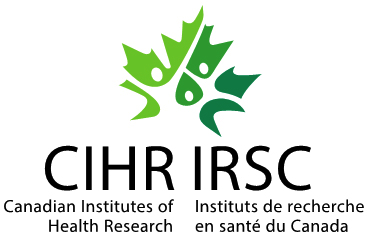

# Generative and integrative modeling for transcriptomics with formalin fixed paraffin embedded material

## Description 
This repository stores the code used to develop the manuscript:
Generative and integrative modeling for transcriptomics with formalin fixed paraffin embedded material

The manuscript is now available on bioRxiv, and has been susbmitted to a scientific journal for peer review:
https://www.biorxiv.org/content/10.1101/2025.02.21.639356v1

This repository *does not* contain the implementation of PREFFECT. It only contains code related to 
the generation of the figures and analyses for the manuscript. The code and documentation is available 
at https://github.com/hallettmiket/preffect

## Authors
**Eliseos John Mucaki -**
*Department of Biochemistry, Western University, London, Canada*

**Wenhan Zhang -**
*Department of Biochemistry, Western University, London, Canada*

**Aryamaan Saha -**
*Department of Biological Engineering and Data Science, Indian Institute of Technology, Madras, India*

**S Trabinjac -**
*Department of Radiation Oncology, Sunnybrook Health Sciences Centre
Department of Laboratory Medicine and Pathobiology, University of Toronto Toronto, Canada*

**Sharon Nofech-Moses -**
*Department of Anatomic Pathology, Sunnybrook Health Sciences Centre*
*Department of Laboratory Medicine and Pathobiology, University of Toronto, Toronto, Canada*

**Eileen Rakovitch -**
*Department of Radiation Oncology, Sunnybrook Health Sciences Centre
Department of Laboratory Medicine and Pathobiology, University of Toronto Toronto, Canada*

**Vanessa Dumeaux -**
*Department of Anatomy and Cell Biology, Department of Oncology, Western University, London, Canada*

**Michael Hallett -**
*Department of Biochemistry, Department of Oncology, Western University, London, Canada*

Contact: [Mike Hallett](mailto:michael.hallett@uwo.ca)

## Software (PREFFECT - PaRaffin Embedded Formalin-FixEd FixEd Cleaning Tool)
PREFFECT software (developed in this study) can be found here:
https://github.com/hallettmiket/preffect/

## Funding

  
  
  
  
  

